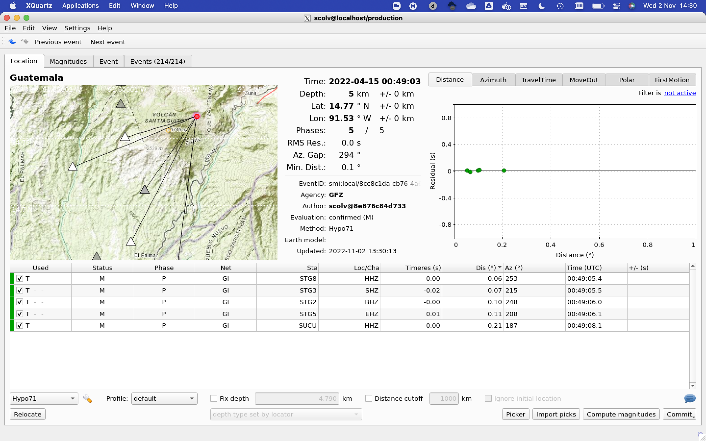

# *Hypo71* configuration for VolcSAT

1. Copy the content of this repo to `~/.seiscomp/hypo71/` :
   ```bash
   git clone https://github.com/VolcSAT/hypo71-config.git ~/.seiscomp/hypo71
   ```
2. Add the content of `global.cfg` to your `~/.seiscomp/global.cfg`:

   ```bash
   cat ~/.seiscomp/hypo71/global.cfg >> ~/.seiscomp/global.cfg
   ```
3. Start `scolv` in debug mode, use *hypo71* locator with **default** *profile*, and report any issue:
   ```bash
   scolv --debug
   ```

